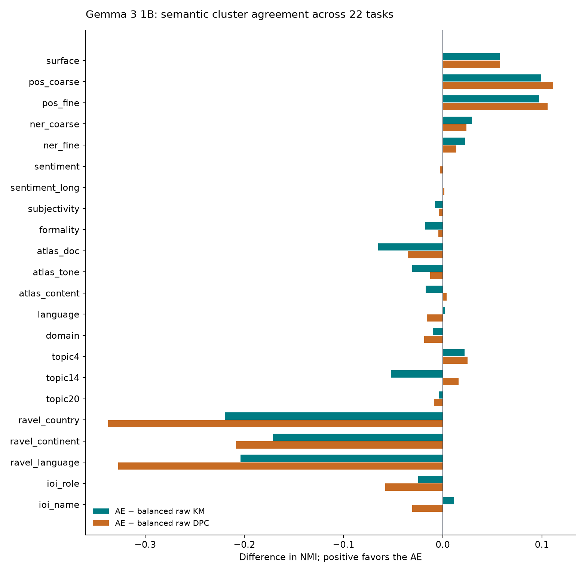

# Gemma 3 1B: DPC AE results

**Last updated: 2026-09-25 00:33:10 UTC**  
**Run:** `gemma3_1b_l25_d2304_dpc_seed42`  
**Verified stages:** 24/24. **Running:** none detected.

This is a saved snapshot, refreshed when requested. A result enters the main tables only after its completion record and output metadata agree. Partial files and collection logs are reported separately; missing scores are not treated as zero.

## Current findings

AE reconstruction changes MMLU from **23.05% to 20.50%** (-2.55 percentage points; 2,000 examples).

The AE has stronger geometric separation than balanced raw k-means: silhouette **0.0281 vs -0.0508**, Davies–Bouldin **2.995 vs 3.942** (lower is better), and **1,998/2,000** clusters above the effective-usage threshold.

The AE centroid matrix is also more concentrated: effective rank **145.0**, versus **376.1** for balanced raw KM. Better separation does not imply more independent semantic directions.

Semantic cluster agreement is mixed. Across 22 tasks, AE mean NMI is **0.2337**, versus **0.2556** for balanced raw KM and **0.2658** for balanced raw DPC. Mean cluster-label F1 is **0.2945**, versus **0.3192** and **0.3175**, respectively.

The current evidence supports improved cluster geometry, not a general improvement in semantic clustering or preservation of model behavior. Token syntax and sequence-level semantics can move differently; the full task tables below show those differences.

A clear task contrast is POS versus RAVEL: AE/base-balanced-KM NMI is **0.4202/0.3208** for pos_coarse; **0.4441/0.3471** for pos_fine; **0.1939/0.4135** for ravel_country. This measures cluster alignment with the labels, not loss or gain of all information available to a trained decoder.

For db14's fixed range-gated zero-removal arm, base/AE selectivity is **0.4415/0.1156**, over 12 paired concepts. The intervention tables include target suppression, collateral damage, and perplexity changes.

For ag_news's fixed range-gated zero-removal arm, base/AE selectivity is **0.0729/0.1401**, over 4 paired concepts. The intervention tables include target suppression, collateral damage, and perplexity changes.

For biasbios's fixed range-gated zero-removal arm, base/AE selectivity is **NR/NR**, over 24 paired concepts. The intervention tables include target suppression, collateral damage, and perplexity changes.

## Run and checkpoint

| Setting | Value |
| --- | --- |
| Frozen model / decoder layer | google/gemma-3-1b-pt / 25 |
| Residual → latent dimensions | 1,152 → 2,304 |
| AE / clusters | Dense GELU + BatchNorm; DPC initialization/reseeding; K=2,000 |
| Extraction budget / retained rows | 10,000,000 / 9,826,031 |
| Activations | float32; all finite=True; maximum absolute value 64,256; no clipping |
| Final checkpoint | Epoch 50; step 14,200; centroids initialized=True |
| Training | Seed 42; batch 32,768; optimizer LR [0.00028] |
| Validation reconstruction MSE | 0.022459 |
| Checkpoint SHA-256 | `1828120473797d050ece68e82b2b8006100845113aabdde8a2bd7d15be87724c` |

The MSE is measured on per-channel normalized activations. The raw identity reference has zero reconstruction error by definition. The 5% validation tail is split by row, not guaranteed disjoint by document.

Sources: [config.yaml](../runs/gemma3_1b_l25_d2304_dpc_seed42/config.yaml), [activation_validation.json](../runs/gemma3_1b_l25_d2304_dpc_seed42/activation_validation.json), [selected.json](../runs/gemma3_1b_l25_d2304_dpc_seed42/checkpoints/selected.json).

## Model preservation

| Metric | Original Gemma | AE reconstruction | AE − base |
| --- | --- | --- | --- |
| MMLU accuracy (2,000 examples) | 23.05% | 20.50% | -2.55 pp |
| Normalized validation MSE | 0 (identity) | 0.022459 | — |

This is the legacy one-token generated-answer scorer: the model generates one token, decoded as A/B/C/D when possible. It is not constrained-choice likelihood scoring or an official benchmark reproduction. Both accuracies are near or below the 25% uniform-choice reference. No paired confidence interval or multi-seed uncertainty estimate is available.

Source: [results_ccc_mmlu.json](../runs/gemma3_1b_l25_d2304_dpc_seed42/evals/results_ccc_mmlu.json).

## Cluster geometry

All codebooks use K=2,000 and normalization fitted from the same Gemma corpus. The main geometry sample contains 1M states; silhouette and Dunn use smaller subsamples. Base codebooks operate on normalized raw activations; the AE codebook operates in its learned latent representation.

| Metric | Base balanced KM | Base balanced DPC | Base plain KM | DPC AE |
| --- | --- | --- | --- | --- |
| Silhouette ↑ | -0.0508 | -0.0623 | -0.1454 | 0.0281 |
| Davies–Bouldin ↓ | 3.9418 | 3.9415 | 2.5785 | 2.9947 |
| Calinski–Harabasz ↑ | 203.3550 | 200.9880 | 58.0383 | 973.9814 |
| Dunn ↑, subsampling-sensitive | 0.0879 | 0.0678 | 0.0830 | 0.0996 |
| Separation ratio | 34.0405 | 34.0790 | 54.5833 | 105.0470 |
| Effective K | 1989 | 1939 | 628 | 1998 |
| Empty clusters | 0 | 0 | 124 | 0 |
| Normalized occupancy entropy | 0.9659 | 0.9534 | 0.2255 | 0.9724 |
| Centered centroid effective rank | 376.1431 | 390.1240 | 607.0970 | 144.9774 |
| Intra-cluster variance | 0.7512 | 0.7828 | 0.5527 | 0.3176 |
| Mean centroid distance | 28.8164 | 29.1784 | 47.1877 | 53.2611 |
| Minimum centroid distance | 7.2089 | 5.6518 | 3.6887 | 8.6768 |

Effective K counts clusters used by more than 0.1/K of sampled tokens; it is not the entropy-based effective count. Rank describes the centered centroid matrix, not semantic dimensionality. Distances and variances depend on the representation's scale. Plain KM's concentrated occupancy makes it a weak sole comparator.

The balanced baselines use uniform Sinkhorn assignments; the AE uses Zipf balancing. Their comparison does not isolate the encoder alone. Baseline fitting and geometry samples may overlap. Small stochastic/subsample metric differences should not be overinterpreted.

Source: [cq_balanced_kmeans.json](../runs/gemma3_1b_l25_d2304_dpc_seed42/evals/cq_balanced_kmeans.json).

Source: [cq_balanced_dpc.json](../runs/gemma3_1b_l25_d2304_dpc_seed42/evals/cq_balanced_dpc.json).

Source: [cq_plain_kmeans.json](../runs/gemma3_1b_l25_d2304_dpc_seed42/evals/cq_plain_kmeans.json).

## Semantic cluster agreement

NMI measures agreement between cluster membership and labels; it is not chance-adjusted mutual information. F1 is the mean over eligible labels of the best single cluster's F1 (minimum support 20). These are descriptive cluster-label scores, not supervised classifier accuracy. Macro means weight each heterogeneous task equally and use the rounded values in the saved artifact. Token tasks are capped at 80,000 rows by the probe CLI; sequence tasks use their full caches.

| Macro average | Base balanced KM | Base balanced DPC | Base plain KM | DPC AE |
| --- | --- | --- | --- | --- |
| All tasks (22): NMI | 0.2556 | 0.2658 | 0.0326 | 0.2337 |
| All tasks (22): F1 | 0.3192 | 0.3175 | 0.2491 | 0.2945 |
| Token tasks (10): NMI | 0.2971 | 0.3317 | 0.0221 | 0.2669 |
| Token tasks (10): F1 | 0.2948 | 0.3044 | 0.1666 | 0.2575 |
| Sequence tasks (12): NMI | 0.2211 | 0.2108 | 0.0414 | 0.2061 |
| Sequence tasks (12): F1 | 0.3396 | 0.3284 | 0.3179 | 0.3253 |

| Comparator | AE task wins: NMI | AE task wins: F1 |
| --- | --- | --- |
| Base balanced KM | 10/22 | 9/22 |
| Base balanced DPC | 9/22 | 10/22 |
| Base plain KM | 22/22 | 14/22 |



Exportable chart: [SVG](assets/gemma3_1b_semantic_delta.svg).

### Per-task NMI

| Task | Base balanced KM | Base balanced DPC | Base plain KM | DPC AE |
| --- | --- | --- | --- | --- |
| surface | 0.2765 | 0.2760 | 0.1152 | 0.3340 |
| pos_coarse | 0.3208 | 0.3088 | 0.0341 | 0.4202 |
| pos_fine | 0.3471 | 0.3383 | 0.0273 | 0.4441 |
| ner_coarse | 0.1193 | 0.1250 | 0.0124 | 0.1488 |
| ner_fine | 0.1527 | 0.1613 | 0.0133 | 0.1751 |
| sentiment | 0.0011 | 0.0042 | 0.0001 | 0.0014 |
| sentiment_long | 0.0437 | 0.0425 | 0.0067 | 0.0440 |
| subjectivity | 0.0301 | 0.0262 | 0.0000 | 0.0224 |
| formality | 0.0725 | 0.0591 | 0.0003 | 0.0548 |
| atlas_doc | 0.3444 | 0.3148 | 0.0641 | 0.2794 |
| atlas_tone | 0.2247 | 0.2064 | 0.0456 | 0.1938 |
| atlas_content | 0.2605 | 0.2394 | 0.0551 | 0.2435 |
| language | 0.5698 | 0.5885 | 0.0040 | 0.5724 |
| domain | 0.3305 | 0.3392 | 0.2398 | 0.3206 |
| topic4 | 0.0916 | 0.0885 | 0.0054 | 0.1137 |
| topic14 | 0.4503 | 0.3820 | 0.0544 | 0.3980 |
| topic20 | 0.2336 | 0.2387 | 0.0216 | 0.2297 |
| ravel_country | 0.4135 | 0.5314 | 0.0000 | 0.1939 |
| ravel_continent | 0.2622 | 0.2994 | 0.0000 | 0.0912 |
| ravel_language | 0.3691 | 0.4925 | 0.0000 | 0.1654 |
| ioi_role | 0.4903 | 0.5234 | 0.0149 | 0.4655 |
| ioi_name | 0.2191 | 0.2611 | 0.0040 | 0.2305 |

### Per-task F1

| Task | Base balanced KM | Base balanced DPC | Base plain KM | DPC AE |
| --- | --- | --- | --- | --- |
| surface | 0.4000 | 0.3452 | 0.3694 | 0.3611 |
| pos_coarse | 0.2577 | 0.2334 | 0.1544 | 0.3220 |
| pos_fine | 0.2412 | 0.2352 | 0.0506 | 0.2937 |
| ner_coarse | 0.1479 | 0.1339 | 0.1469 | 0.1775 |
| ner_fine | 0.1316 | 0.1232 | 0.0216 | 0.1112 |
| sentiment | 0.5251 | 0.5616 | 0.6051 | 0.5995 |
| sentiment_long | 0.2431 | 0.2637 | 0.6644 | 0.3227 |
| subjectivity | 0.6104 | 0.5453 | 0.6666 | 0.5932 |
| formality | 0.4619 | 0.4188 | 0.4979 | 0.3988 |
| atlas_doc | 0.3182 | 0.2874 | 0.1082 | 0.2150 |
| atlas_tone | 0.1078 | 0.0952 | 0.0338 | 0.0855 |
| atlas_content | 0.1211 | 0.1124 | 0.0413 | 0.1285 |
| language | 0.5299 | 0.5590 | 0.0952 | 0.4373 |
| domain | 0.2917 | 0.3226 | 0.4619 | 0.2311 |
| topic4 | 0.3476 | 0.3360 | 0.3902 | 0.3783 |
| topic14 | 0.4102 | 0.3315 | 0.1529 | 0.4165 |
| topic20 | 0.1080 | 0.1075 | 0.0978 | 0.0975 |
| ravel_country | 0.2449 | 0.2946 | 0.0384 | 0.0896 |
| ravel_continent | 0.4354 | 0.3838 | 0.2790 | 0.2834 |
| ravel_language | 0.2503 | 0.3235 | 0.0617 | 0.1059 |
| ioi_role | 0.6386 | 0.7351 | 0.4989 | 0.6517 |
| ioi_name | 0.2003 | 0.2366 | 0.0450 | 0.1791 |

Source: [concept_probe.json](../runs/gemma3_1b_l25_d2304_dpc_seed42/evals/concept_probe.json).

Atlas document labels use single-label chunks, tone uses a rarest-label reduction, and content uses a commonest-label reduction. Those derived labels are not equivalent to original single-label ground truth.

## Local geometry and plots

| Task | Points | Classes | Raw h kNN | AE latent kNN | AE − raw |
| --- | --- | --- | --- | --- | --- |
| pos_coarse | 6,000 | 8 | 80.7% | 87.0% | +6.3 pp |
| pos_fine | 6,000 | 8 | 82.7% | 87.3% | +4.6 pp |
| ravel_country | 1,266 | 8 | 87.2% | 86.2% | -1.0 pp |
| topic14 | 1,776 | 8 | 93.7% | 87.1% | -6.6 pp |
| language | 1,308 | 8 | 99.0% | 97.3% | -1.7 pp |

kNN-10 uses a 60/40 stratified split and PCA to 50 components in each representation. PCA is fitted before the split, making this an exploratory, transductive neighborhood diagnostic. The eight most frequent classes are shown, not the full task. Scores above reproduce the rounded log values. PCA/t-SNE layouts are separate per representation; t-SNE distances between panels have no common scale.

Source: [geometry.log](../runs/gemma3_1b_l25_d2304_dpc_seed42/logs/geometry.log).

| Task | PCA | t-SNE |
| --- | --- | --- |
| pos_coarse | [pca](../runs/gemma3_1b_l25_d2304_dpc_seed42/figures/pca/pos_coarse.png) | [tsne](../runs/gemma3_1b_l25_d2304_dpc_seed42/figures/tsne/pos_coarse.png) |
| pos_fine | [pca](../runs/gemma3_1b_l25_d2304_dpc_seed42/figures/pca/pos_fine.png) | [tsne](../runs/gemma3_1b_l25_d2304_dpc_seed42/figures/tsne/pos_fine.png) |
| ravel_country | [pca](../runs/gemma3_1b_l25_d2304_dpc_seed42/figures/pca/ravel_country.png) | [tsne](../runs/gemma3_1b_l25_d2304_dpc_seed42/figures/tsne/ravel_country.png) |
| topic14 | [pca](../runs/gemma3_1b_l25_d2304_dpc_seed42/figures/pca/topic14.png) | [tsne](../runs/gemma3_1b_l25_d2304_dpc_seed42/figures/tsne/topic14.png) |
| language | [pca](../runs/gemma3_1b_l25_d2304_dpc_seed42/figures/pca/language.png) | [tsne](../runs/gemma3_1b_l25_d2304_dpc_seed42/figures/tsne/language.png) |


## Causal evaluations and coverage

Selectivity S = target accuracy drop − complement accuracy drop; positive AE − base favors the AE. Compare h and z on paired concepts, keeping collateral damage and perplexity changes visible. Limited jointly correct examples can exclude classes. These results do not establish general factual editing ability.

### Range interventions: db14

| Operator | Paired concepts | Base S | AE S | ΔS | Base target drop | AE target drop | Base collateral | AE collateral | Base ΔPPL | AE ΔPPL |
| --- | --- | --- | --- | --- | --- | --- | --- | --- | --- | --- |
| rm_full_comp | 12 | 0.4126 | 0.4888 | 0.0762 | 0.9209 | 0.9127 | 0.5083 | 0.4240 | 26.52 | 29.51 |
| rm_full_zero | 12 | 0.2518 | 0.0135 | -0.2383 | 0.8987 | 1.0000 | 0.6469 | 0.9865 | 244.26 | 65.81 |
| rm_range_comp | 12 | 0.6308 | 0.6809 | 0.0501 | 0.9100 | 0.9038 | 0.2792 | 0.2229 | 0.14 | 0.14 |
| rm_range_zero | 12 | 0.4415 | 0.1156 | -0.3259 | 0.9019 | 0.9572 | 0.4604 | 0.8417 | 1.10 | 1.73 |
| st_global_a0.5 | 12 | 0.6172 | 0.6058 | -0.0114 | 0.8193 | 0.7766 | 0.2021 | 0.1708 | 0.13 | 0.12 |
| st_global_a1.0 | 12 | 0.5610 | 0.6011 | 0.0401 | 0.9350 | 0.9396 | 0.3740 | 0.3385 | 0.51 | 0.49 |
| st_global_a2.0 | 12 | 0.3969 | 0.4146 | 0.0177 | 1.0000 | 1.0000 | 0.6031 | 0.5854 | 2.30 | 2.21 |
| st_range_a0.5 | 12 | 0.5745 | 0.5428 | -0.0318 | 0.7204 | 0.6480 | 0.1458 | 0.1052 | 0.02 | 0.03 |
| st_range_a1.0 | 12 | 0.6090 | 0.6638 | 0.0548 | 0.9059 | 0.9169 | 0.2969 | 0.2531 | 0.10 | 0.09 |
| st_range_a2.0 | 12 | 0.4933 | 0.4917 | -0.0017 | 0.9933 | 1.0000 | 0.5000 | 0.5083 | 0.41 | 0.33 |
| st_salient_a0.5 | 12 | 0.5783 | 0.5514 | -0.0269 | 0.7440 | 0.6785 | 0.1656 | 0.1271 | 0.10 | 0.09 |
| st_salient_a1.0 | 12 | 0.6204 | 0.6523 | 0.0319 | 0.9193 | 0.9304 | 0.2990 | 0.2781 | 0.41 | 0.37 |
| st_salient_a2.0 | 12 | 0.4900 | 0.4792 | -0.0108 | 0.9983 | 1.0000 | 0.5083 | 0.5208 | 1.79 | 1.67 |
| st_transport_a0.5 | 12 | 0.5558 | 0.5285 | -0.0272 | 0.7193 | 0.6473 | 0.1635 | 0.1187 | 0.02 | 0.03 |
| st_transport_a1.0 | 12 | 0.5878 | 0.6259 | 0.0381 | 0.9055 | 0.9093 | 0.3177 | 0.2833 | 0.11 | 0.10 |
| st_transport_a2.0 | 12 | 0.4562 | 0.4677 | 0.0115 | 0.9917 | 1.0000 | 0.5354 | 0.5323 | 0.46 | 0.37 |

Source: [range_db14.json](../runs/gemma3_1b_l25_d2304_dpc_seed42/evals/range_db14.json).

Joint-correct collection diagnostics from the latest log (candidate counts, not evaluated sample sizes):

| Class | Label | Joint-correct candidates found |
| --- | --- | --- |
| 0 | Company | 24 |
| 1 | EducationalInstitution | 38 |
| 2 | Artist | 130 |
| 3 | Athlete | 0 |
| 4 | OfficeHolder | 130 |
| 5 | MeanOfTransportation | 0 |
| 6 | Building | 130 |
| 7 | NaturalPlace | 130 |
| 8 | Village | 130 |
| 9 | Animal | 130 |
| 10 | Plant | 112 |
| 11 | Album | 130 |
| 12 | Film | 54 |
| 13 | WrittenWork | 130 |

Collection/progress source: [range_db14.log](../runs/gemma3_1b_l25_d2304_dpc_seed42/logs/range_db14.log).

### Range interventions: ag_news

| Operator | Paired concepts | Base S | AE S | ΔS | Base target drop | AE target drop | Base collateral | AE collateral | Base ΔPPL | AE ΔPPL |
| --- | --- | --- | --- | --- | --- | --- | --- | --- | --- | --- |
| rm_full_comp | 4 | 0.4624 | 0.5273 | 0.0650 | 0.8061 | 0.8211 | 0.3438 | 0.2938 | 18.42 | 25.67 |
| rm_full_zero | 4 | -0.0299 | 0.0143 | 0.0442 | 0.6357 | 0.9643 | 0.6656 | 0.9500 | 339.25 | 42.78 |
| rm_range_comp | 4 | 0.6377 | 0.7426 | 0.1049 | 0.7908 | 0.8207 | 0.1531 | 0.0781 | 0.46 | 0.40 |
| rm_range_zero | 4 | 0.0729 | 0.1401 | 0.0671 | 0.6167 | 0.9432 | 0.5437 | 0.8031 | 8.88 | 2.84 |
| st_global_a0.5 | 4 | 0.7212 | 0.7023 | -0.0189 | 0.7400 | 0.7336 | 0.0188 | 0.0312 | 0.14 | 0.13 |
| st_global_a1.0 | 4 | 0.8430 | 0.8157 | -0.0273 | 0.9337 | 0.9439 | 0.0906 | 0.1281 | 0.57 | 0.53 |
| st_global_a2.0 | 4 | 0.6875 | 0.6594 | -0.0281 | 1.0000 | 1.0000 | 0.3125 | 0.3406 | 2.53 | 2.34 |
| st_range_a0.5 | 4 | 0.6297 | 0.6447 | 0.0150 | 0.6579 | 0.6572 | 0.0281 | 0.0125 | 0.04 | 0.06 |
| st_range_a1.0 | 4 | 0.7554 | 0.8123 | 0.0569 | 0.8335 | 0.8622 | 0.0781 | 0.0500 | 0.19 | 0.19 |
| st_range_a2.0 | 4 | 0.7472 | 0.8086 | 0.0614 | 0.9847 | 0.9898 | 0.2375 | 0.1813 | 0.83 | 0.72 |
| st_salient_a0.5 | 4 | 0.6411 | 0.6271 | -0.0140 | 0.6630 | 0.6521 | 0.0219 | 0.0250 | 0.11 | 0.11 |
| st_salient_a1.0 | 4 | 0.7602 | 0.7784 | 0.0182 | 0.8539 | 0.8878 | 0.0938 | 0.1094 | 0.44 | 0.43 |
| st_salient_a2.0 | 4 | 0.7511 | 0.7375 | -0.0136 | 0.9949 | 1.0000 | 0.2438 | 0.2625 | 1.96 | 1.84 |
| st_transport_a0.5 | 4 | 0.6411 | 0.6322 | -0.0088 | 0.6629 | 0.6572 | 0.0219 | 0.0250 | 0.05 | 0.06 |
| st_transport_a1.0 | 4 | 0.7687 | 0.7986 | 0.0299 | 0.8437 | 0.8674 | 0.0750 | 0.0688 | 0.21 | 0.20 |
| st_transport_a2.0 | 4 | 0.7225 | 0.8210 | 0.0985 | 0.9694 | 0.9898 | 0.2469 | 0.1687 | 0.89 | 0.80 |

Source: [range_ag_news.json](../runs/gemma3_1b_l25_d2304_dpc_seed42/evals/range_ag_news.json).

Joint-correct collection diagnostics from the latest log (candidate counts, not evaluated sample sizes):

| Class | Label | Joint-correct candidates found |
| --- | --- | --- |
| 0 | World | 130 |
| 1 | Sports | 130 |
| 2 | Business | 130 |
| 3 | Sci/Tech | 82 |

Collection/progress source: [range_ag_news.log](../runs/gemma3_1b_l25_d2304_dpc_seed42/logs/range_ag_news.log).

### Range interventions: biasbios

| Operator | Paired concepts | Base S | AE S | ΔS | Base target drop | AE target drop | Base collateral | AE collateral | Base ΔPPL | AE ΔPPL |
| --- | --- | --- | --- | --- | --- | --- | --- | --- | --- | --- |
| rm_full_comp | 24 | NR | NR | NR | NR | NR | 0.5240 | 0.6359 | 17.28 | 27.64 |
| rm_full_zero | 24 | NR | NR | NR | NR | NR | 0.6307 | 0.9771 | 51.65 | 46.70 |
| rm_range_comp | 24 | NR | NR | NR | NR | NR | 0.2062 | 0.2990 | 0.17 | 0.15 |
| rm_range_zero | 24 | NR | NR | NR | NR | NR | 0.3573 | 0.7479 | 1.12 | 1.65 |
| st_global_a1.0 | 24 | NR | NR | NR | NR | NR | 0.2849 | 0.3083 | 0.65 | 0.55 |
| st_global_a2.0 | 24 | NR | NR | NR | NR | NR | 0.5307 | 0.5365 | 3.48 | 2.86 |
| st_range_a1.0 | 24 | NR | NR | NR | NR | NR | 0.2344 | 0.2938 | 0.12 | 0.11 |
| st_range_a2.0 | 24 | NR | NR | NR | NR | NR | 0.5099 | 0.5349 | 0.52 | 0.40 |
| st_salient_a1.0 | 24 | NR | NR | NR | NR | NR | 0.2177 | 0.2714 | 0.51 | 0.42 |
| st_salient_a2.0 | 24 | NR | NR | NR | NR | NR | 0.4734 | 0.4745 | 2.42 | 2.05 |
| st_transport_a1.0 | 24 | NR | NR | NR | NR | NR | 0.2615 | 0.3109 | 0.14 | 0.11 |
| st_transport_a2.0 | 24 | NR | NR | NR | NR | NR | 0.5458 | 0.5594 | 0.58 | 0.43 |

Source: [range_biasbios.json](../runs/gemma3_1b_l25_d2304_dpc_seed42/evals/range_biasbios.json).

Collection/progress source: [range_biasbios.log](../runs/gemma3_1b_l25_d2304_dpc_seed42/logs/range_biasbios.log).

### Dense DB14 steering

| Alpha | Paired concepts | Base S | AE S | ΔS |
| --- | --- | --- | --- | --- |
| a0.5 | 12 | -0.6380 | -0.6216 | 0.0163 |
| a1.0 | 12 | -0.5525 | -0.5867 | -0.0342 |
| a2.0 | 12 | -0.4062 | -0.4094 | -0.0031 |
| a4.0 | 12 | -0.2490 | -0.2479 | 0.0010 |
| a8.0 | 12 | -0.0365 | -0.0323 | 0.0042 |

Source: [steer_db14.json](../runs/gemma3_1b_l25_d2304_dpc_seed42/evals/steer_db14.json).

### Grammatical number control

Completed 144 arms. Joint-correct test population: 144 prompts.

| Metric | Original Gemma | AE reconstruction |
| --- | --- | --- |
| Unedited is/are pair accuracy | 100.00% | 100.00% |

| Arm | All-example S | Joint-correct S | Joint target drop | Joint collateral | Joint counterpart top-1 | Neutral KL |
| --- | --- | --- | --- | --- | --- | --- |
| h:suppress_singular:global:a0.5 | 0.4167 | 0.4167 | 0.4167 | 0.0000 | 0.0000 | 0.0198 |
| h:suppress_singular:global:a1.0 | 1.0000 | 1.0000 | 1.0000 | 0.0000 | 0.2500 | 0.1110 |
| h:suppress_singular:global:a2.0 | 1.0000 | 1.0000 | 1.0000 | 0.0000 | 0.9444 | 1.4324 |
| h:suppress_singular:salient:a0.5 | 0.2500 | 0.2500 | 0.2500 | 0.0000 | 0.0000 | 0.0173 |
| h:suppress_singular:salient:a1.0 | 0.9722 | 0.9722 | 0.9722 | 0.0000 | 0.2361 | 0.0837 |
| h:suppress_singular:salient:a2.0 | 1.0000 | 1.0000 | 1.0000 | 0.0000 | 0.9861 | 0.7376 |
| h:suppress_singular:range:a0.5 | 0.2361 | 0.2361 | 0.2361 | 0.0000 | 0.0000 | 0.0146 |
| h:suppress_singular:range:a1.0 | 0.8333 | 0.8333 | 0.8333 | 0.0000 | 0.2083 | 0.0615 |
| h:suppress_singular:range:a2.0 | 1.0000 | 1.0000 | 1.0000 | 0.0000 | 0.8889 | 0.3412 |
| h:suppress_singular:transport:a0.5 | 0.2222 | 0.2222 | 0.2222 | 0.0000 | 0.0000 | 0.0177 |
| h:suppress_singular:transport:a1.0 | 0.8750 | 0.8750 | 0.8750 | 0.0000 | 0.2083 | 0.0733 |
| h:suppress_singular:transport:a2.0 | 1.0000 | 1.0000 | 1.0000 | 0.0000 | 0.9028 | 0.3888 |
| h:suppress_plural:global:a0.5 | 0.8333 | 0.8333 | 0.8333 | 0.0000 | 0.0000 | 0.0183 |
| h:suppress_plural:global:a1.0 | 1.0000 | 1.0000 | 1.0000 | 0.0000 | 0.3333 | 0.0848 |
| h:suppress_plural:global:a2.0 | 1.0000 | 1.0000 | 1.0000 | 0.0000 | 0.7361 | 0.8775 |
| h:suppress_plural:salient:a0.5 | 0.3611 | 0.3611 | 0.3611 | 0.0000 | 0.0000 | 0.0155 |
| h:suppress_plural:salient:a1.0 | 1.0000 | 1.0000 | 1.0000 | 0.0000 | 0.0139 | 0.0615 |
| h:suppress_plural:salient:a2.0 | 1.0000 | 1.0000 | 1.0000 | 0.0000 | 0.3333 | 0.4205 |
| h:suppress_plural:range:a0.5 | 0.2778 | 0.2778 | 0.2778 | 0.0000 | 0.0000 | 0.0153 |
| h:suppress_plural:range:a1.0 | 1.0000 | 1.0000 | 1.0000 | 0.0000 | 0.0139 | 0.0612 |
| h:suppress_plural:range:a2.0 | 1.0000 | 1.0000 | 1.0000 | 0.0000 | 0.3611 | 0.2595 |
| h:suppress_plural:transport:a0.5 | 0.2778 | 0.2778 | 0.2778 | 0.0000 | 0.0000 | 0.0145 |
| h:suppress_plural:transport:a1.0 | 1.0000 | 1.0000 | 1.0000 | 0.0000 | 0.0139 | 0.0570 |
| h:suppress_plural:transport:a2.0 | 1.0000 | 1.0000 | 1.0000 | 0.0000 | 0.3472 | 0.2412 |
| z:suppress_singular:global:a0.5 | 0.4444 | 0.4444 | 0.4444 | 0.0000 | 0.0278 | 0.0213 |
| z:suppress_singular:global:a1.0 | 1.0000 | 1.0000 | 1.0000 | 0.0000 | 0.2639 | 0.1265 |
| z:suppress_singular:global:a2.0 | 1.0000 | 1.0000 | 1.0000 | 0.0000 | 0.9583 | 1.6826 |
| z:suppress_singular:salient:a0.5 | 0.4167 | 0.4167 | 0.4167 | 0.0000 | 0.0139 | 0.0232 |
| z:suppress_singular:salient:a1.0 | 1.0000 | 1.0000 | 1.0000 | 0.0000 | 0.2361 | 0.1315 |
| z:suppress_singular:salient:a2.0 | 1.0000 | 1.0000 | 1.0000 | 0.0000 | 0.8889 | 1.5482 |
| z:suppress_singular:range:a0.5 | 0.3889 | 0.3889 | 0.3889 | 0.0000 | 0.0000 | 0.0396 |
| z:suppress_singular:range:a1.0 | 1.0000 | 1.0000 | 1.0000 | 0.0000 | 0.2083 | 0.1699 |
| z:suppress_singular:range:a2.0 | 1.0000 | 1.0000 | 1.0000 | 0.0000 | 0.7361 | 0.9988 |
| z:suppress_singular:transport:a0.5 | 0.4444 | 0.4444 | 0.4444 | 0.0000 | 0.0000 | 0.0311 |
| z:suppress_singular:transport:a1.0 | 1.0000 | 1.0000 | 1.0000 | 0.0000 | 0.2361 | 0.1371 |
| z:suppress_singular:transport:a2.0 | 1.0000 | 1.0000 | 1.0000 | 0.0000 | 0.7361 | 0.9414 |
| z:suppress_plural:global:a0.5 | 0.7639 | 0.7639 | 0.7639 | 0.0000 | 0.0000 | 0.0195 |
| z:suppress_plural:global:a1.0 | 1.0000 | 1.0000 | 1.0000 | 0.0000 | 0.3194 | 0.0894 |
| z:suppress_plural:global:a2.0 | 1.0000 | 1.0000 | 1.0000 | 0.0000 | 0.7778 | 0.9690 |
| z:suppress_plural:salient:a0.5 | 0.7083 | 0.7083 | 0.7083 | 0.0000 | 0.0000 | 0.0207 |
| z:suppress_plural:salient:a1.0 | 1.0000 | 1.0000 | 1.0000 | 0.0000 | 0.2500 | 0.0928 |
| z:suppress_plural:salient:a2.0 | 1.0000 | 1.0000 | 1.0000 | 0.0000 | 0.9444 | 0.7686 |
| z:suppress_plural:range:a0.5 | 0.6806 | 0.6806 | 0.6806 | 0.0000 | 0.0000 | 0.0281 |
| z:suppress_plural:range:a1.0 | 1.0000 | 1.0000 | 1.0000 | 0.0000 | 0.1250 | 0.1113 |
| z:suppress_plural:range:a2.0 | 1.0000 | 1.0000 | 1.0000 | 0.0000 | 0.7639 | 0.4800 |
| z:suppress_plural:transport:a0.5 | 0.7917 | 0.7917 | 0.7917 | 0.0000 | 0.0000 | 0.0238 |
| z:suppress_plural:transport:a1.0 | 1.0000 | 1.0000 | 1.0000 | 0.0000 | 0.1528 | 0.0936 |
| z:suppress_plural:transport:a2.0 | 1.0000 | 1.0000 | 1.0000 | 0.0000 | 0.8472 | 0.4297 |
| z_rot0:suppress_singular:global:a0.5 | 0.4444 | 0.4444 | 0.4444 | 0.0000 | 0.0278 | 0.0213 |
| z_rot0:suppress_singular:global:a1.0 | 1.0000 | 1.0000 | 1.0000 | 0.0000 | 0.2639 | 0.1265 |
| z_rot0:suppress_singular:global:a2.0 | 1.0000 | 1.0000 | 1.0000 | 0.0000 | 0.9583 | 1.6826 |
| z_rot0:suppress_singular:salient:a0.5 | 0.2222 | 0.2222 | 0.2222 | 0.0000 | 0.0139 | 0.0326 |
| z_rot0:suppress_singular:salient:a1.0 | 0.8611 | 0.8611 | 0.8611 | 0.0000 | 0.0972 | 0.1355 |
| z_rot0:suppress_singular:salient:a2.0 | 1.0000 | 1.0000 | 1.0000 | 0.0000 | 0.4444 | 0.8174 |
| z_rot0:suppress_singular:range:a0.5 | 0.1528 | 0.1528 | 0.1528 | 0.0000 | 0.0000 | 0.0285 |
| z_rot0:suppress_singular:range:a1.0 | 0.7500 | 0.7500 | 0.7500 | 0.0000 | 0.1250 | 0.1123 |
| z_rot0:suppress_singular:range:a2.0 | 1.0000 | 1.0000 | 1.0000 | 0.0000 | 0.5000 | 0.5057 |
| z_rot0:suppress_singular:transport:a0.5 | 0.1528 | 0.1528 | 0.1528 | 0.0000 | 0.0000 | 0.0295 |
| z_rot0:suppress_singular:transport:a1.0 | 0.8056 | 0.8056 | 0.8056 | 0.0000 | 0.1111 | 0.1169 |
| z_rot0:suppress_singular:transport:a2.0 | 1.0000 | 1.0000 | 1.0000 | 0.0000 | 0.5417 | 0.5255 |
| z_rot0:suppress_plural:global:a0.5 | 0.7639 | 0.7639 | 0.7639 | 0.0000 | 0.0000 | 0.0195 |
| z_rot0:suppress_plural:global:a1.0 | 1.0000 | 1.0000 | 1.0000 | 0.0000 | 0.3194 | 0.0894 |
| z_rot0:suppress_plural:global:a2.0 | 1.0000 | 1.0000 | 1.0000 | 0.0000 | 0.7778 | 0.9690 |
| z_rot0:suppress_plural:salient:a0.5 | 0.1250 | 0.1250 | 0.1250 | 0.0000 | 0.0000 | 0.0337 |
| z_rot0:suppress_plural:salient:a1.0 | 1.0000 | 1.0000 | 1.0000 | 0.0000 | 0.0000 | 0.1381 |
| z_rot0:suppress_plural:salient:a2.0 | 1.0000 | 1.0000 | 1.0000 | 0.0000 | 0.2500 | 0.7348 |
| z_rot0:suppress_plural:range:a0.5 | 0.0694 | 0.0694 | 0.0694 | 0.0000 | 0.0000 | 0.0284 |
| z_rot0:suppress_plural:range:a1.0 | 1.0000 | 1.0000 | 1.0000 | 0.0000 | 0.0000 | 0.1125 |
| z_rot0:suppress_plural:range:a2.0 | 1.0000 | 1.0000 | 1.0000 | 0.0000 | 0.1806 | 0.5170 |
| z_rot0:suppress_plural:transport:a0.5 | 0.0972 | 0.0972 | 0.0972 | 0.0000 | 0.0000 | 0.0285 |
| z_rot0:suppress_plural:transport:a1.0 | 1.0000 | 1.0000 | 1.0000 | 0.0000 | 0.0000 | 0.1180 |
| z_rot0:suppress_plural:transport:a2.0 | 1.0000 | 1.0000 | 1.0000 | 0.0000 | 0.1667 | 0.5213 |
| z_rot1:suppress_singular:global:a0.5 | 0.4444 | 0.4444 | 0.4444 | 0.0000 | 0.0278 | 0.0213 |
| z_rot1:suppress_singular:global:a1.0 | 1.0000 | 1.0000 | 1.0000 | 0.0000 | 0.2639 | 0.1265 |
| z_rot1:suppress_singular:global:a2.0 | 1.0000 | 1.0000 | 1.0000 | 0.0000 | 0.9583 | 1.6826 |
| z_rot1:suppress_singular:salient:a0.5 | 0.2917 | 0.2917 | 0.2917 | 0.0000 | 0.0000 | 0.0292 |
| z_rot1:suppress_singular:salient:a1.0 | 0.9861 | 0.9861 | 0.9861 | 0.0000 | 0.2222 | 0.1310 |
| z_rot1:suppress_singular:salient:a2.0 | 1.0000 | 1.0000 | 1.0000 | 0.0000 | 0.8472 | 1.0077 |
| z_rot1:suppress_singular:range:a0.5 | 0.2639 | 0.2639 | 0.2639 | 0.0000 | 0.0000 | 0.0278 |
| z_rot1:suppress_singular:range:a1.0 | 0.9444 | 0.9444 | 0.9444 | 0.0000 | 0.2083 | 0.1131 |
| z_rot1:suppress_singular:range:a2.0 | 1.0000 | 1.0000 | 1.0000 | 0.0000 | 0.7500 | 0.5217 |
| z_rot1:suppress_singular:transport:a0.5 | 0.2639 | 0.2639 | 0.2639 | 0.0000 | 0.0000 | 0.0276 |
| z_rot1:suppress_singular:transport:a1.0 | 0.9722 | 0.9722 | 0.9722 | 0.0000 | 0.2222 | 0.1149 |
| z_rot1:suppress_singular:transport:a2.0 | 1.0000 | 1.0000 | 1.0000 | 0.0000 | 0.8194 | 0.5200 |
| z_rot1:suppress_plural:global:a0.5 | 0.7639 | 0.7639 | 0.7639 | 0.0000 | 0.0000 | 0.0195 |
| z_rot1:suppress_plural:global:a1.0 | 1.0000 | 1.0000 | 1.0000 | 0.0000 | 0.3194 | 0.0894 |
| z_rot1:suppress_plural:global:a2.0 | 1.0000 | 1.0000 | 1.0000 | 0.0000 | 0.7778 | 0.9690 |
| z_rot1:suppress_plural:salient:a0.5 | 0.2778 | 0.2778 | 0.2778 | 0.0000 | 0.0000 | 0.0295 |
| z_rot1:suppress_plural:salient:a1.0 | 1.0000 | 1.0000 | 1.0000 | 0.0000 | 0.0833 | 0.1251 |
| z_rot1:suppress_plural:salient:a2.0 | 1.0000 | 1.0000 | 1.0000 | 0.0000 | 0.0417 | 0.7697 |
| z_rot1:suppress_plural:range:a0.5 | 0.1944 | 0.1944 | 0.1944 | 0.0000 | 0.0000 | 0.0354 |
| z_rot1:suppress_plural:range:a1.0 | 1.0000 | 1.0000 | 1.0000 | 0.0000 | 0.0556 | 0.1460 |
| z_rot1:suppress_plural:range:a2.0 | 1.0000 | 1.0000 | 1.0000 | 0.0000 | 0.0694 | 0.6773 |
| z_rot1:suppress_plural:transport:a0.5 | 0.2778 | 0.2778 | 0.2778 | 0.0000 | 0.0000 | 0.0369 |
| z_rot1:suppress_plural:transport:a1.0 | 1.0000 | 1.0000 | 1.0000 | 0.0000 | 0.0556 | 0.1462 |
| z_rot1:suppress_plural:transport:a2.0 | 1.0000 | 1.0000 | 1.0000 | 0.0000 | 0.0139 | 0.7049 |
| z_rot2:suppress_singular:global:a0.5 | 0.4444 | 0.4444 | 0.4444 | 0.0000 | 0.0278 | 0.0213 |
| z_rot2:suppress_singular:global:a1.0 | 1.0000 | 1.0000 | 1.0000 | 0.0000 | 0.2639 | 0.1265 |
| z_rot2:suppress_singular:global:a2.0 | 1.0000 | 1.0000 | 1.0000 | 0.0000 | 0.9583 | 1.6826 |
| z_rot2:suppress_singular:salient:a0.5 | 0.2361 | 0.2361 | 0.2361 | 0.0000 | 0.0000 | 0.0319 |
| z_rot2:suppress_singular:salient:a1.0 | 0.9167 | 0.9167 | 0.9167 | 0.0000 | 0.0417 | 0.1396 |
| z_rot2:suppress_singular:salient:a2.0 | 1.0000 | 1.0000 | 1.0000 | 0.0000 | 0.3472 | 0.9862 |
| z_rot2:suppress_singular:range:a0.5 | 0.2083 | 0.2083 | 0.2083 | 0.0000 | 0.0000 | 0.0208 |
| z_rot2:suppress_singular:range:a1.0 | 0.8611 | 0.8611 | 0.8611 | 0.0000 | 0.0278 | 0.0868 |
| z_rot2:suppress_singular:range:a2.0 | 1.0000 | 1.0000 | 1.0000 | 0.0000 | 0.2917 | 0.4389 |
| z_rot2:suppress_singular:transport:a0.5 | 0.2222 | 0.2222 | 0.2222 | 0.0000 | 0.0000 | 0.0224 |
| z_rot2:suppress_singular:transport:a1.0 | 0.8889 | 0.8889 | 0.8889 | 0.0000 | 0.0417 | 0.0913 |
| z_rot2:suppress_singular:transport:a2.0 | 1.0000 | 1.0000 | 1.0000 | 0.0000 | 0.2083 | 0.4363 |
| z_rot2:suppress_plural:global:a0.5 | 0.7639 | 0.7639 | 0.7639 | 0.0000 | 0.0000 | 0.0195 |
| z_rot2:suppress_plural:global:a1.0 | 1.0000 | 1.0000 | 1.0000 | 0.0000 | 0.3194 | 0.0894 |
| z_rot2:suppress_plural:global:a2.0 | 1.0000 | 1.0000 | 1.0000 | 0.0000 | 0.7778 | 0.9690 |
| z_rot2:suppress_plural:salient:a0.5 | 0.1250 | 0.1250 | 0.1250 | 0.0000 | 0.0000 | 0.0303 |
| z_rot2:suppress_plural:salient:a1.0 | 1.0000 | 1.0000 | 1.0000 | 0.0000 | 0.0000 | 0.1180 |
| z_rot2:suppress_plural:salient:a2.0 | 1.0000 | 1.0000 | 1.0000 | 0.0000 | 0.5417 | 0.5388 |
| z_rot2:suppress_plural:range:a0.5 | 0.0833 | 0.0833 | 0.0833 | 0.0000 | 0.0000 | 0.0246 |
| z_rot2:suppress_plural:range:a1.0 | 0.9861 | 0.9861 | 0.9861 | 0.0000 | 0.0000 | 0.0999 |
| z_rot2:suppress_plural:range:a2.0 | 1.0000 | 1.0000 | 1.0000 | 0.0000 | 0.4028 | 0.4970 |
| z_rot2:suppress_plural:transport:a0.5 | 0.0694 | 0.0694 | 0.0694 | 0.0000 | 0.0000 | 0.0229 |
| z_rot2:suppress_plural:transport:a1.0 | 0.9861 | 0.9861 | 0.9861 | 0.0000 | 0.0000 | 0.0959 |
| z_rot2:suppress_plural:transport:a2.0 | 1.0000 | 1.0000 | 1.0000 | 0.0000 | 0.4444 | 0.4876 |
| z_shuffled:suppress_singular:global:a0.5 | 0.0000 | 0.0000 | 0.0000 | 0.0000 | 0.0000 | 0.0016 |
| z_shuffled:suppress_singular:global:a1.0 | 0.0000 | 0.0000 | 0.0000 | 0.0000 | 0.0000 | 0.0047 |
| z_shuffled:suppress_singular:global:a2.0 | 0.0000 | 0.0000 | 0.0000 | 0.0000 | 0.0000 | 0.0154 |
| z_shuffled:suppress_singular:salient:a0.5 | 0.0000 | 0.0000 | 0.0000 | 0.0000 | 0.0000 | 0.0016 |
| z_shuffled:suppress_singular:salient:a1.0 | 0.0000 | 0.0000 | 0.0000 | 0.0000 | 0.0000 | 0.0051 |
| z_shuffled:suppress_singular:salient:a2.0 | 0.0000 | 0.0000 | 0.0000 | 0.0000 | 0.0000 | 0.0161 |
| z_shuffled:suppress_singular:range:a0.5 | 0.0000 | 0.0000 | 0.0000 | 0.0000 | 0.0000 | 0.0011 |
| z_shuffled:suppress_singular:range:a1.0 | 0.0000 | 0.0000 | 0.0000 | 0.0000 | 0.0000 | 0.0025 |
| z_shuffled:suppress_singular:range:a2.0 | 0.0000 | 0.0000 | 0.0000 | 0.0000 | 0.0000 | 0.0091 |
| z_shuffled:suppress_singular:transport:a0.5 | 0.0000 | 0.0000 | 0.0000 | 0.0000 | 0.0000 | 0.0012 |
| z_shuffled:suppress_singular:transport:a1.0 | 0.0000 | 0.0000 | 0.0000 | 0.0000 | 0.0000 | 0.0039 |
| z_shuffled:suppress_singular:transport:a2.0 | 0.0000 | 0.0000 | 0.0000 | 0.0000 | 0.0000 | 0.0126 |
| z_shuffled:suppress_plural:global:a0.5 | 0.0000 | 0.0000 | 0.0000 | 0.0000 | 0.0000 | 0.0012 |
| z_shuffled:suppress_plural:global:a1.0 | 0.0000 | 0.0000 | 0.0000 | 0.0000 | 0.0000 | 0.0032 |
| z_shuffled:suppress_plural:global:a2.0 | -0.0556 | -0.0556 | 0.0000 | 0.0556 | 0.0000 | 0.0122 |
| z_shuffled:suppress_plural:salient:a0.5 | 0.0000 | 0.0000 | 0.0000 | 0.0000 | 0.0000 | 0.0011 |
| z_shuffled:suppress_plural:salient:a1.0 | 0.0000 | 0.0000 | 0.0000 | 0.0000 | 0.0000 | 0.0033 |
| z_shuffled:suppress_plural:salient:a2.0 | -0.0417 | -0.0417 | 0.0000 | 0.0417 | 0.0000 | 0.0134 |
| z_shuffled:suppress_plural:range:a0.5 | 0.0000 | 0.0000 | 0.0000 | 0.0000 | 0.0000 | 0.0011 |
| z_shuffled:suppress_plural:range:a1.0 | 0.0000 | 0.0000 | 0.0000 | 0.0000 | 0.0000 | 0.0024 |
| z_shuffled:suppress_plural:range:a2.0 | -0.0417 | -0.0417 | 0.0000 | 0.0417 | 0.0000 | 0.0087 |
| z_shuffled:suppress_plural:transport:a0.5 | 0.0000 | 0.0000 | 0.0000 | 0.0000 | 0.0000 | 0.0011 |
| z_shuffled:suppress_plural:transport:a1.0 | 0.0000 | 0.0000 | 0.0000 | 0.0000 | 0.0000 | 0.0035 |
| z_shuffled:suppress_plural:transport:a2.0 | -0.0139 | -0.0139 | 0.0000 | 0.0139 | 0.0000 | 0.0131 |

All-example and joint-correct populations remain separate. Pair-restricted is/are flips are not full-vocabulary generation success. Rotation and shuffled-label arms are retained as controls; no best-alpha selection is performed.

Source: [number_dprime.json](../runs/gemma3_1b_l25_d2304_dpc_seed42/evals/number_dprime.json).

## Pipeline status

Completion is checked against saved file size and modification time, following the launcher's stage records. This is not a fresh rerun or a full content hash of the multi-GB activation dump.

| Stage | Status | Completed duration | Log |
| --- | --- | --- | --- |
| preflight | Complete | 0.1 min | [log](../runs/gemma3_1b_l25_d2304_dpc_seed42/logs/preflight.log) |
| extract | Complete | 38.6 min | [log](../runs/gemma3_1b_l25_d2304_dpc_seed42/logs/extract.log) |
| validate_activations | Complete | 0.3 min | [log](../runs/gemma3_1b_l25_d2304_dpc_seed42/logs/validate_activations.log) |
| train | Complete | 199.1 min | [log](../runs/gemma3_1b_l25_d2304_dpc_seed42/logs/train.log) |
| balanced_kmeans | Complete | 0.6 min | [log](../runs/gemma3_1b_l25_d2304_dpc_seed42/logs/balanced_kmeans.log) |
| balanced_dpc | Complete | 0.4 min | [log](../runs/gemma3_1b_l25_d2304_dpc_seed42/logs/balanced_dpc.log) |
| plain_kmeans | Complete | 146.5 min | [log](../runs/gemma3_1b_l25_d2304_dpc_seed42/logs/plain_kmeans.log) |
| concept_cache | Complete | 1.7 min | [log](../runs/gemma3_1b_l25_d2304_dpc_seed42/logs/concept_cache.log) |
| ravel_cache | Complete | 0.8 min | [log](../runs/gemma3_1b_l25_d2304_dpc_seed42/logs/ravel_cache.log) |
| ioi_cache | Complete | 2.3 min | [log](../runs/gemma3_1b_l25_d2304_dpc_seed42/logs/ioi_cache.log) |
| atlas_cache | Complete | 1.2 min | [log](../runs/gemma3_1b_l25_d2304_dpc_seed42/logs/atlas_cache.log) |
| validate_cache | Complete | 0.2 min | [log](../runs/gemma3_1b_l25_d2304_dpc_seed42/logs/validate_cache.log) |
| mmlu | Complete | 0.7 min | [log](../runs/gemma3_1b_l25_d2304_dpc_seed42/logs/mmlu.log) |
| cq_balanced_kmeans | Complete | 2.5 min | [log](../runs/gemma3_1b_l25_d2304_dpc_seed42/logs/cq_balanced_kmeans.log) |
| cq_balanced_dpc | Complete | 1.3 min | [log](../runs/gemma3_1b_l25_d2304_dpc_seed42/logs/cq_balanced_dpc.log) |
| cq_plain_kmeans | Complete | 1.7 min | [log](../runs/gemma3_1b_l25_d2304_dpc_seed42/logs/cq_plain_kmeans.log) |
| probe | Complete | 0.3 min | [log](../runs/gemma3_1b_l25_d2304_dpc_seed42/logs/probe.log) |
| geometry | Complete | 1.4 min | [log](../runs/gemma3_1b_l25_d2304_dpc_seed42/logs/geometry.log) |
| range_db14 | Complete | 80.4 min | [log](../runs/gemma3_1b_l25_d2304_dpc_seed42/logs/range_db14.log) |
| range_ag_news | Complete | 15.3 min | [log](../runs/gemma3_1b_l25_d2304_dpc_seed42/logs/range_ag_news.log) |
| range_biasbios | Complete | 52.8 min | [log](../runs/gemma3_1b_l25_d2304_dpc_seed42/logs/range_biasbios.log) |
| steer_db14 | Complete | 11.3 min | [log](../runs/gemma3_1b_l25_d2304_dpc_seed42/logs/steer_db14.log) |
| number | Complete | 3.8 min | [log](../runs/gemma3_1b_l25_d2304_dpc_seed42/logs/number.log) |
| summary | Complete | 0.0 min | [log](../runs/gemma3_1b_l25_d2304_dpc_seed42/logs/summary.log) |

## Provenance, limitations, and updates

This is one AE training seed and one width (2×). No multi-seed confidence estimates or causal superiority claims follow from the current geometric improvements. The Gemma scores are not a matched comparison to earlier Llama experiments. The frozen model uses BF16 compute and float32 stored activations; no clipping was used.

The initial sequence-cache sampling defect was repaired using full-split shuffling; seven sequence caches were regenerated. Geometry's integer-object labels were encoded as categorical IDs for kNN while preserving plot labels. Earlier partial caches/plots were backed up; this report uses the verified completed replacements.

Repair provenance: [audit.json](../runs/gemma3_1b_l25_d2304_dpc_seed42/repairs/concept_sequence_shuffle_v1/audit.json).

Repair provenance: [repair.json](../runs/gemma3_1b_l25_d2304_dpc_seed42/repairs/geometry_label_dtype_v1/repair.json).

Refresh on the next requested update:

```bash
.venv/bin/python eval_out/update_gemma_report.py
```

The refresh reads artifacts and regenerates this report, its embedded-figure HTML, and a JSON snapshot. It does not launch jobs or change the experiment manifest.

| UTC snapshot | Newly completed stages | Running at snapshot |
| --- | --- | --- |
| 2026-09-24 05:44:00 UTC | preflight, extract, validate_activations, train, balanced_kmeans, balanced_dpc, plain_kmeans, concept_cache, ravel_cache, ioi_cache, atlas_cache, validate_cache, mmlu, cq_balanced_kmeans, cq_balanced_dpc, cq_plain_kmeans, probe, geometry | range_db14 |
| 2026-09-24 06:40:05 UTC | range_db14, range_ag_news | range_biasbios |
| 2026-09-24 23:22:38 UTC | No new completion | None detected |
| 2026-09-25 00:33:10 UTC | range_biasbios, steer_db14, number, summary | None detected |

### Verified result artifacts

- [concept_probe.json](../runs/gemma3_1b_l25_d2304_dpc_seed42/evals/concept_probe.json)

- [cq_balanced_dpc.json](../runs/gemma3_1b_l25_d2304_dpc_seed42/evals/cq_balanced_dpc.json)

- [cq_balanced_kmeans.json](../runs/gemma3_1b_l25_d2304_dpc_seed42/evals/cq_balanced_kmeans.json)

- [cq_plain_kmeans.json](../runs/gemma3_1b_l25_d2304_dpc_seed42/evals/cq_plain_kmeans.json)

- [number_dprime.json](../runs/gemma3_1b_l25_d2304_dpc_seed42/evals/number_dprime.json)

- [range_ag_news.json](../runs/gemma3_1b_l25_d2304_dpc_seed42/evals/range_ag_news.json)

- [range_biasbios.json](../runs/gemma3_1b_l25_d2304_dpc_seed42/evals/range_biasbios.json)

- [range_db14.json](../runs/gemma3_1b_l25_d2304_dpc_seed42/evals/range_db14.json)

- [results_ccc_mmlu.json](../runs/gemma3_1b_l25_d2304_dpc_seed42/evals/results_ccc_mmlu.json)

- [steer_db14.json](../runs/gemma3_1b_l25_d2304_dpc_seed42/evals/steer_db14.json)
